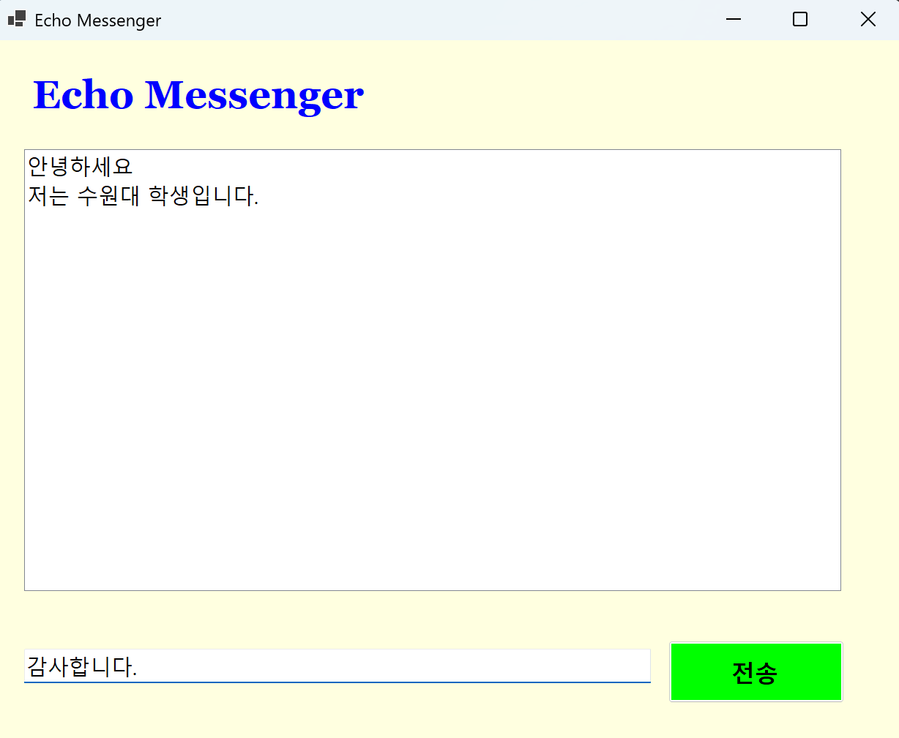
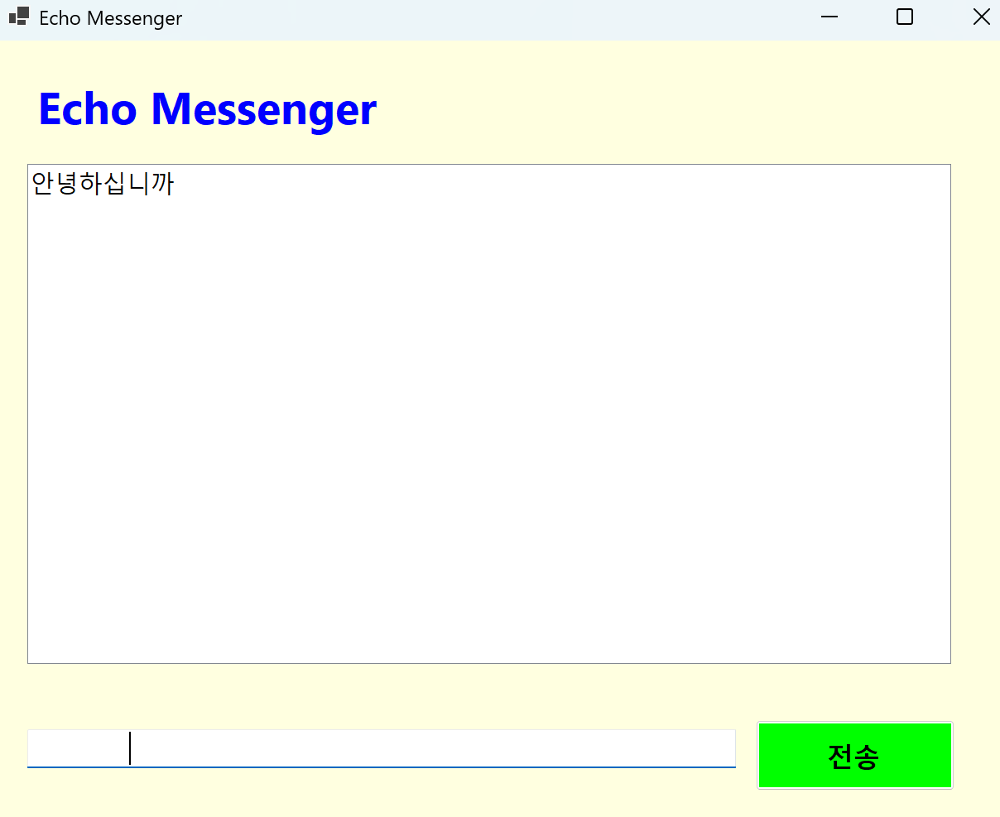
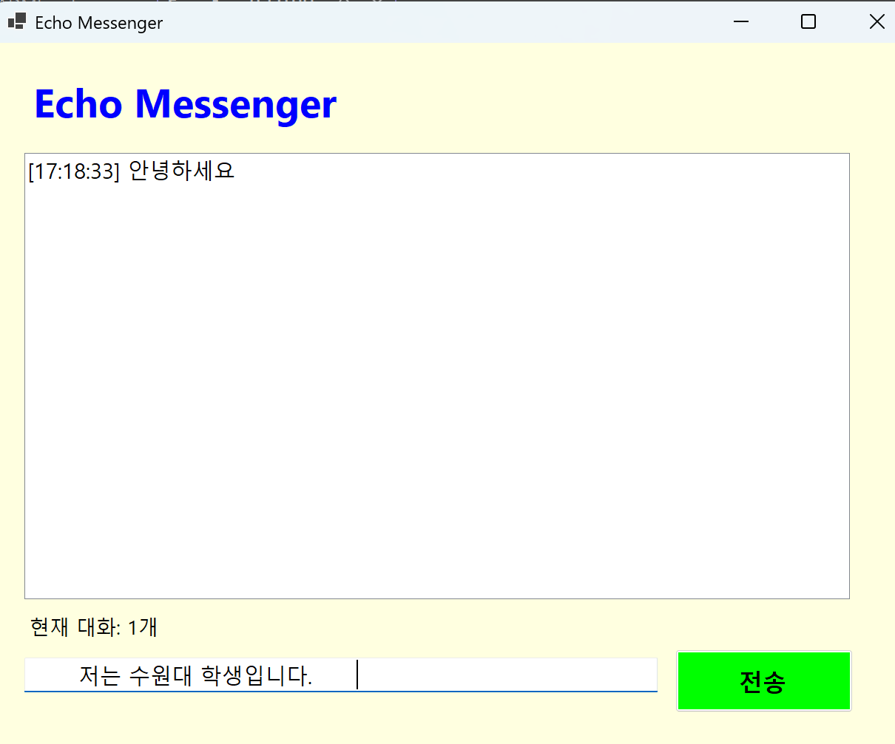
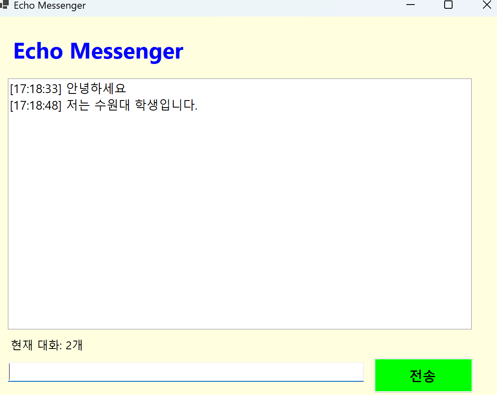
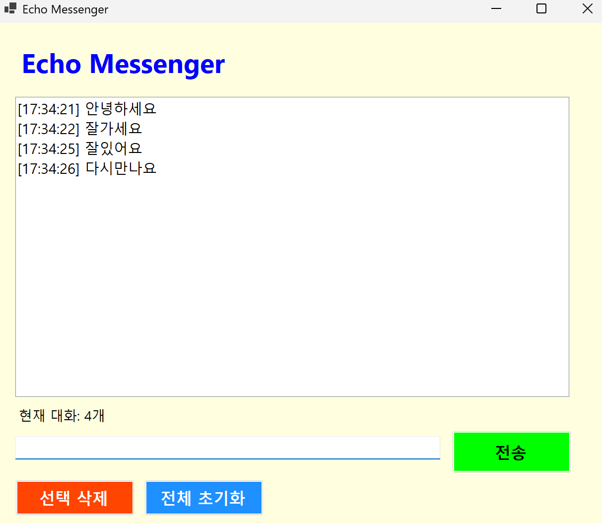
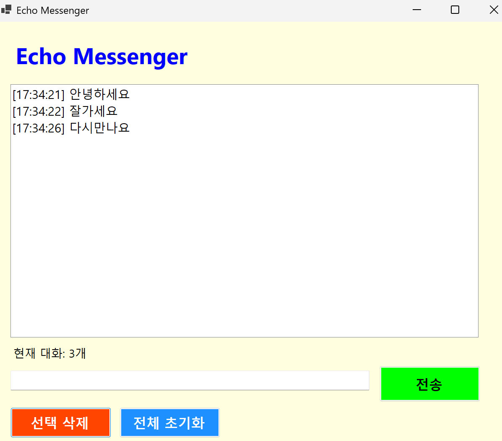
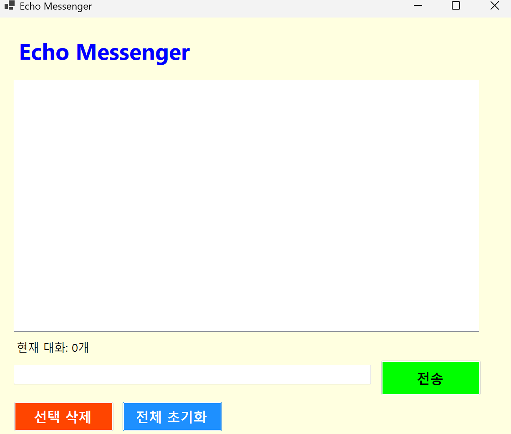
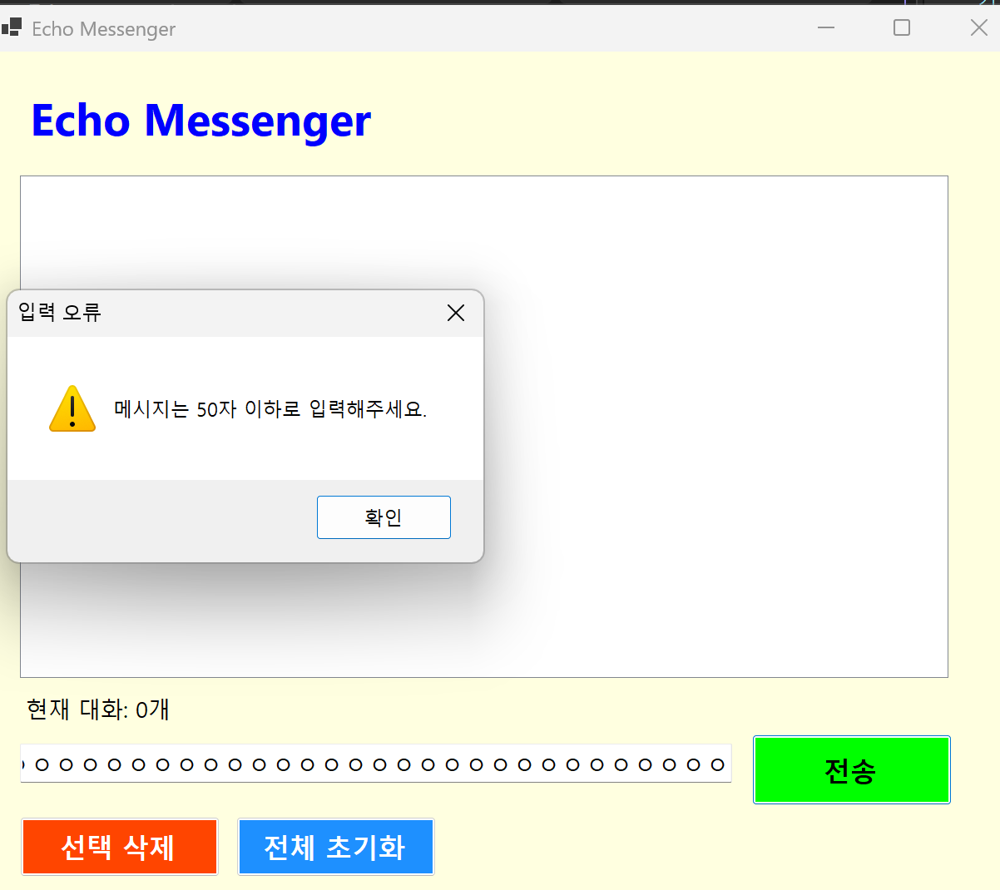

# (C# 코딩) 에코 메신저
## 개요
- C# 프로그래밍 학습
- 1줄 소개: 텍스트 박스에 원하는 내용을 입력하면 그것을 리스트박스에 올리는 프로그램.
- 사용한 플랫폼: C#, .NET Windows Forms, Visual Studio, GitHub
- 사용한 컨트롤: Label, TextBox, ListBox, Button
- 사용한 기술과 구현한 기능:
- - Visual Studio를 이용하여 UI 디자인
  - string 클래스를 이용한 사용자 입력 데이터 처리 (Trim(), IsNullOrWhiteSpace(), Length)
  - DateTime 클래스를 이용한 현재 시간 정보 구하기 (DateTime.Now.ToString("HH:mm:ss"))
  - 문자열 보간법($"")을 이용한 메시지 포맷 구성
  - ListBox의 Items 컬렉션을 이용한 메시지 목록 관리

  구현한 기능:
  - 텍스트박스에 메시지 입력 후 버튼 클릭 또는 Enter 키로 전송
  - 메시지 전송 시 타임스탬프([HH:mm:ss]) 자동 추가
  - 현재 대화 수 실시간 표시
  - 선택한 항목 삭제 (미선택 시 경고 메시지)
  - 전체 대화 초기화
  - 50자 초과 입력 시 전송 차단 및 경고 메시지
  - 앱 시작 시 입력창 자동 포커스

## 실행 화면 (과제1)
- 과제1 코드의 실행 스크린샷

- 과제 내용
    - Label(표시), TextBox(입력), Button(전송), ListBox(대화창)를 적절히 배치합니다.
    - 전송 버튼 클릭 시 TextBox의 텍스트를 ListBox의 항목(Items)으로 추가합니다.
    - 추가 직후 TextBox의 내용을 비워(Clear) 다음 입력을 준비합니다.
- 구현 내용과 기능 설명
    - 입력창에 메시지를 입력하고 전송 버튼을 누르면 메시지가 리스트 박스에 표시된다.
    - 계속 반복하면 메시지가 리스트 박스에 한 줄씩 계속 추가된다.
    - 추가 내용이 많아지면 리스트 박스에 스크롤바가 자동으로 생기고 스크롤된다.
	

## 실행 화면 (과제2)
- 과제2 코드의 실행 스크린샷

 - 과제 내용
    - KeyDown 이벤트를 이용하여 Enter 키 입력 시 전송 버튼 클릭과 동일하게
  동작합니다.
    - 앱 시작 시 Shown 이벤트를 이용하여 입력창에 자동으로 포커스를 줍니다.
    - 전송 후 Focus()를 호출하여 입력창으로 포커스를 복귀시킵니다.
 - 구현 내용과 기능 설명
    - 앱을 실행하면 별도 클릭 없이 바로 메시지를 입력할 수 있다.
    - 전송 버튼 클릭뿐 아니라 Enter 키만으로도 메시지를 전송할 수 있다.
    - 전송 후 자동으로 입력창에 포커스가 돌아와 연속 입력이 편리하다.

## 실행 화면 (과제3)
- 과제3 코드의 실행 스크린샷

- 과제 내용
    - DateTime.Now를 이용하여 메시지 전송 시각을 [HH:mm:ss] 형식으로 앞에 붙입니다.
    - Trim()을 이용하여 앞뒤 공백을 제거한 뒤 전송합니다.
    - IsNullOrWhiteSpace()로 빈 입력을 차단합니다.
    - Label을 이용하여 현재 대화 수를 실시간으로 표시합니다.
- 구현 내용과 기능 설명
    - 메시지 앞에 전송 시각이 [HH:mm:ss] 형식으로 자동으로 붙어서 표시된다.
    - 공백만 입력하거나 아무것도 입력하지 않으면 전송되지 않는다.
    - 현재 리스트 박스에 쌓인 메시지 수가 하단 라벨에 실시간으로 반영된다.

## 실행 화면 (과제4)
- 과제4 코드의 실행 스크린샷

  - 과제 내용
    - 선택 삭제 버튼 클릭 시 ListBox에서 선택된 항목을 RemoveAt()으로 제거합니다.
    - 항목이 선택되지 않은 상태에서 삭제 시 MessageBox로 경고를 표시합니다.
    - 전체 초기화 버튼 클릭 시 Items.Clear()로 모든 항목을 삭제합니다.
    - 입력 글자 수가 50자를 초과하면 MessageBox로 경고 후 전송을 차단합니다.
  - 구현 내용과 기능 설명
    - 리스트 박스에서 특정 메시지를 클릭하고 선택 삭제 버튼을 누르면 해당 항목만
  삭제된다.
    - 아무것도 선택하지 않고 삭제 버튼을 누르면 경고 메시지가 표시된다.
    - 전체 초기화 버튼을 누르면 리스트 박스의 모든 메시지가 한 번에 삭제된다.
    - 50자를 초과하여 입력하면 경고 메시지가 뜨고 전송되지 않는다.